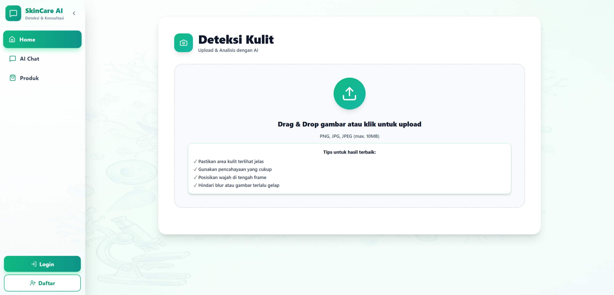
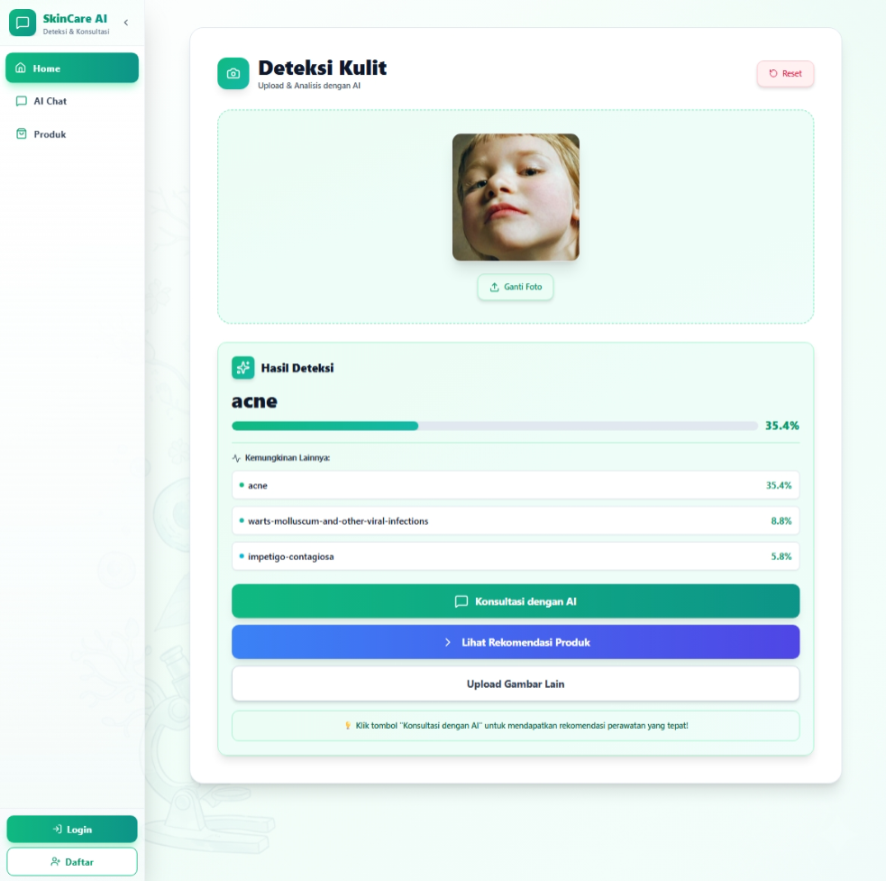
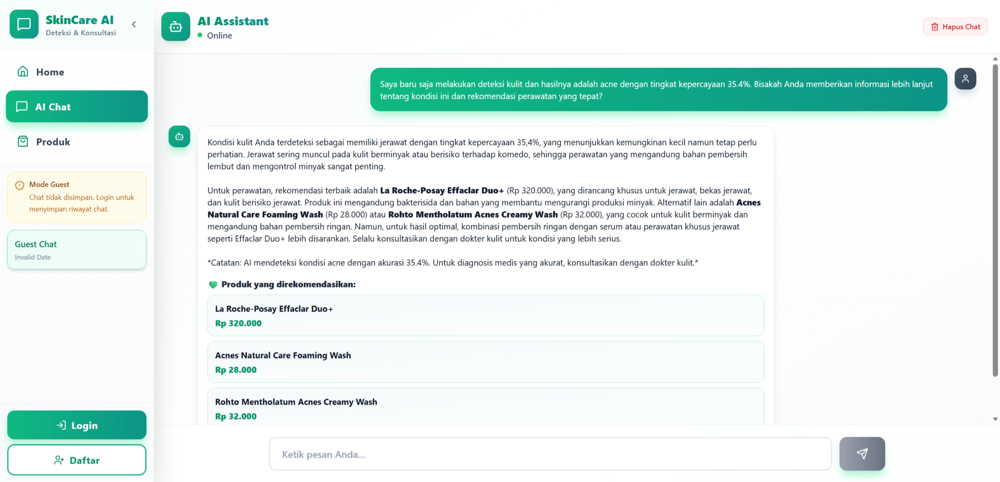
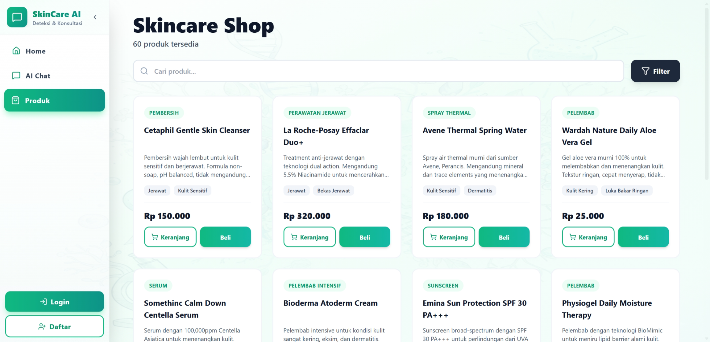
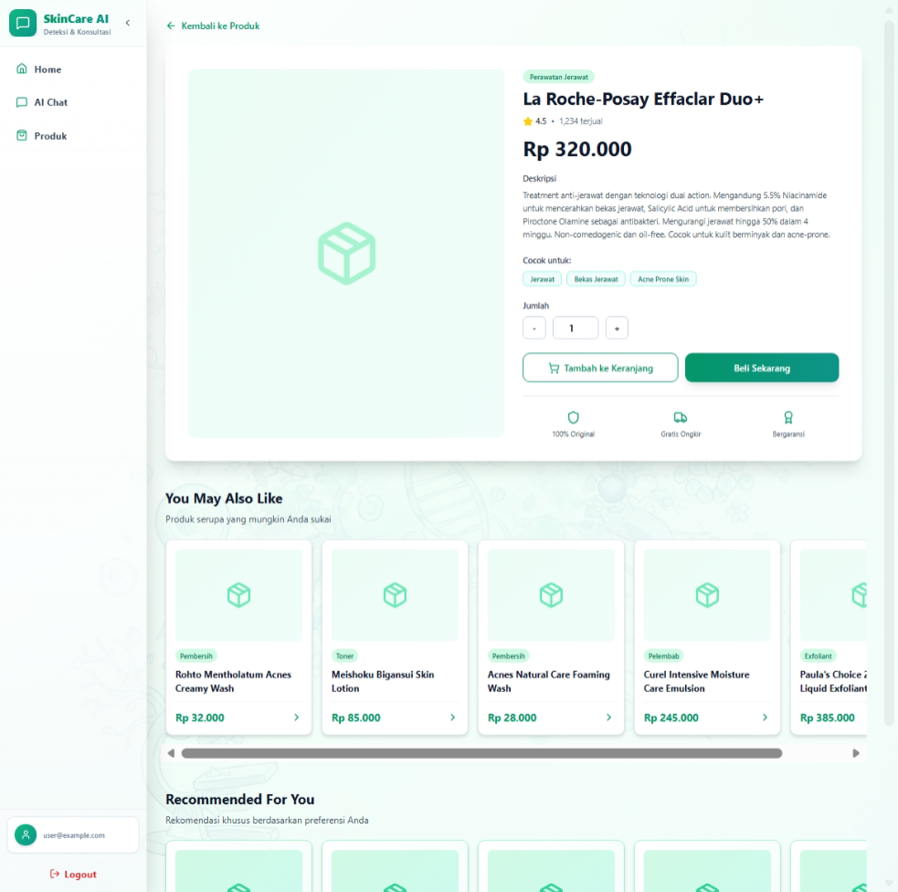

# Skincare Chatbot Frontend



An AI-powered web application that analyzes skin conditions through image uploads and provides personalized skincare product recommendations via an intelligent chatbot. Visit [skincare.farhanage.site](https://skincare.farhanage.site) to see the app in action!

## How It Works

1. **Upload Photo** - Take or upload a photo of your skin condition
2. **AI Analysis** - Our AI identifies potential skin issues
3. **Get Recommendations** - Chat with AI for personalized product suggestions
4. **Shop** - Browse and purchase recommended products
5. **Track Orders** - View your order history and status

## Features

### User Authentication
- Secure login and registration system
- Guest mode for trying features without an account
- Role-based access (Admin/User)

### AI Skin Analysis
- Upload photos via drag-and-drop or click
- Instant AI-powered skin condition detection
- Confidence scores for predictions
- Results inform personalized recommendations

### Smart AI Chatbot
- Get product recommendations based on your skin condition
- Multiple chat sessions to organize conversations
- Chat history saved for logged-in users
- Works for guests with local storage

### E-Commerce Store
- Browse skincare products with filters (category, condition, price)
- Search functionality
- Shopping cart with easy checkout
- Order history and tracking

### Embeddings and Multi Armed Bandit (Thompson Sampling) based Product Recommendations
- Personalized product recommendations: AI matches products to your product interactions to surface tailored suggestions.
- Continuous learning with privacy: recommendations improve from interactions while only anonymized data/embeddings are stored.


## Screenshots

### Home Page - Skin Analysis



### AI Chat Interface



### Product Catalog & Shopping



### Recommendations



## Built With

- **React** 19.1.1 - UI framework
- **React Router** 7.9.1 - Navigation
- **Tailwind CSS** 3.4.0 - Styling
- **Axios** 1.12.2 - API requests
- **Lucide React** - Icons
- **Highcharts** - Admin analytics

## Project Structure

```
src/
├── features/           # Main app features
│   ├── auth/          # Login & Registration
│   ├── chat/          # AI chatbot
│   ├── products/      # Product catalog
│   ├── cart/          # Shopping cart
│   ├── orders/        # Checkout & history
│   ├── upload/        # Skin analysis
│   └── admin/         # Admin panel
├── components/        # Reusable components
├── services/          # API integration
├── hooks/             # Custom React hooks
├── pages/             # Page components
└── utils/             # Helper functions
```

## Quick Start

### Prerequisites
- Node.js 14+ and npm
- Backend API running (default: `http://localhost:8000`)

### Installation

```bash
# Clone the repository
git clone https://github.com/farhanage/skincare-chatbot-frontend.git
cd skincare-chatbot-frontend

# Install dependencies
npm install

# Create .env file
echo "REACT_APP_API_URL=http://localhost:8000" > .env

# Start the app
npm start
```

### Build for Production

```bash
npm run build
```

## API Endpoints

### Authentication
- `POST /api/auth/register` - Sign up
- `POST /api/auth/login` - Sign in

### Skin Analysis
- `POST /predict` - Upload image for disease detection

### Chat
- `POST /api/chat` - Send message
- `GET /api/chats` - Get chat history
- `POST /api/chats` - Create new chat

### Products & Orders
- `GET /api/products` - Browse products
- `POST /api/cart` - Add to cart
- `POST /api/orders` - Place order
- `GET /api/orders` - Order history

### Admin
- `GET /api/admin/debug/{endpoint}` - System info & management

## For Developers

### Adding New Features

**Services** - Create API calls in `src/services/`:
```javascript
import axios from 'axios';
import { REACT_APP_API_BASE_URL } from '../utils/constants';

export const myApiCall = async (data) => {
  const token = localStorage.getItem('token');
  return await axios.post(`${REACT_APP_API_BASE_URL}/endpoint`, data, {
    headers: { Authorization: `Bearer ${token}` }
  });
};
```

**Custom Hooks** - Use built-in hooks:
```javascript
import { useAuth, useCart, useChat } from '../hooks';

const { user, login } = useAuth();
const { cartItems, addToCart } = useCart(user);
const { sessions, sendMessage } = useChat(user);
```

## Security

- JWT token authentication
- Role-based access control
- Input validation on all forms
- Secure API communication

## License

This project is licensed under the MIT License - see the [LICENSE](LICENSE) file for details.

## Contributing

Contributions welcome! Please open an issue or submit a pull request.

Frontend Repository: [github.com/farhanage/skincare-chatbot-frontend](https://github.com/farhanage/skincare-chatbot-frontend)

Backend Repository: [github.com/farhanage/skincare-chatbot-backend](https://github.com/farhanage/skincare-chatbot-backend)

---